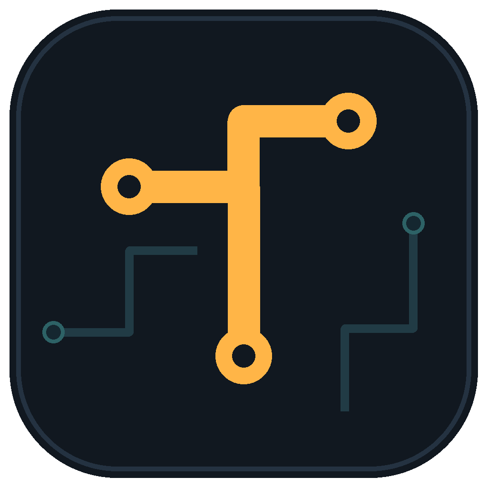
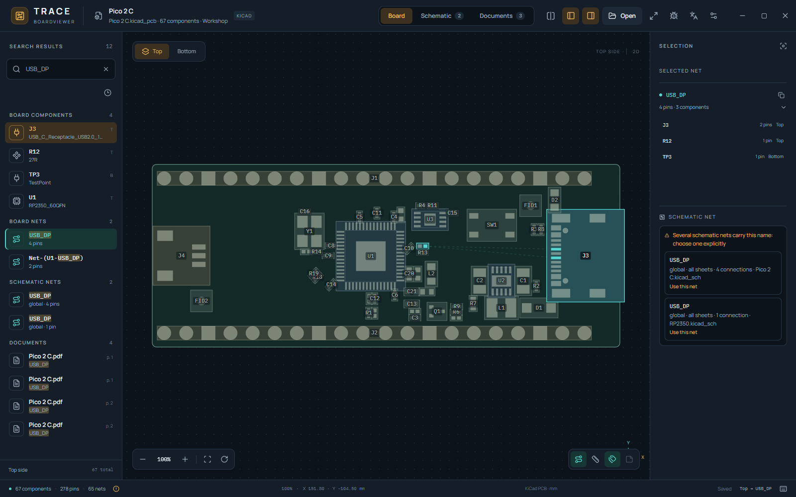
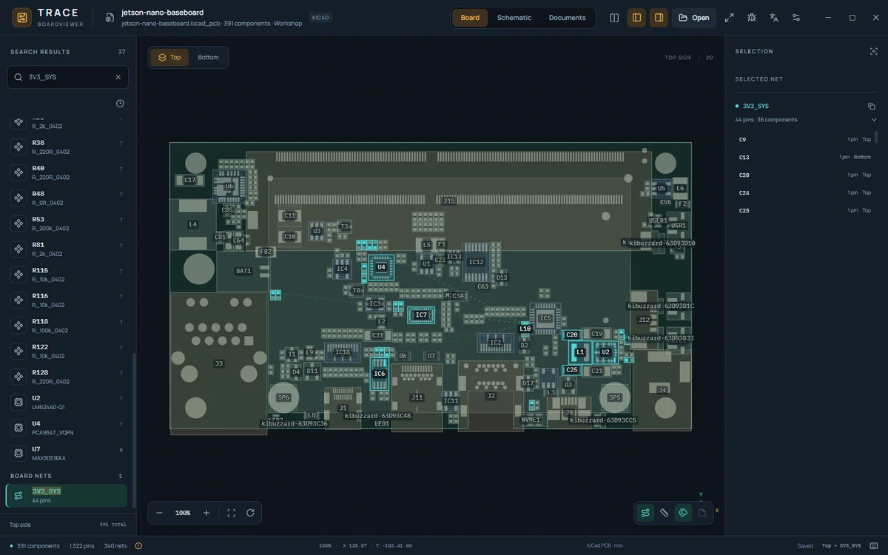
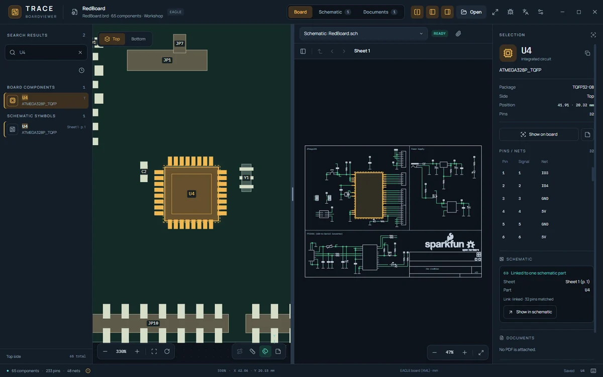
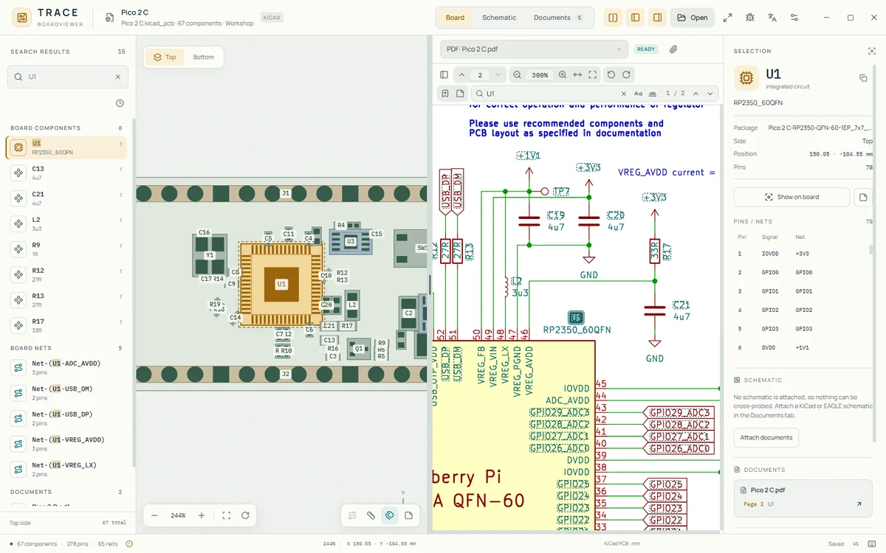
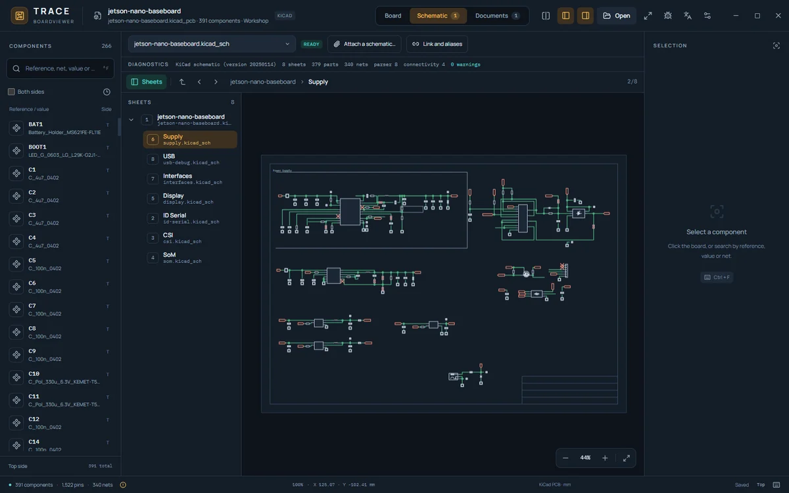
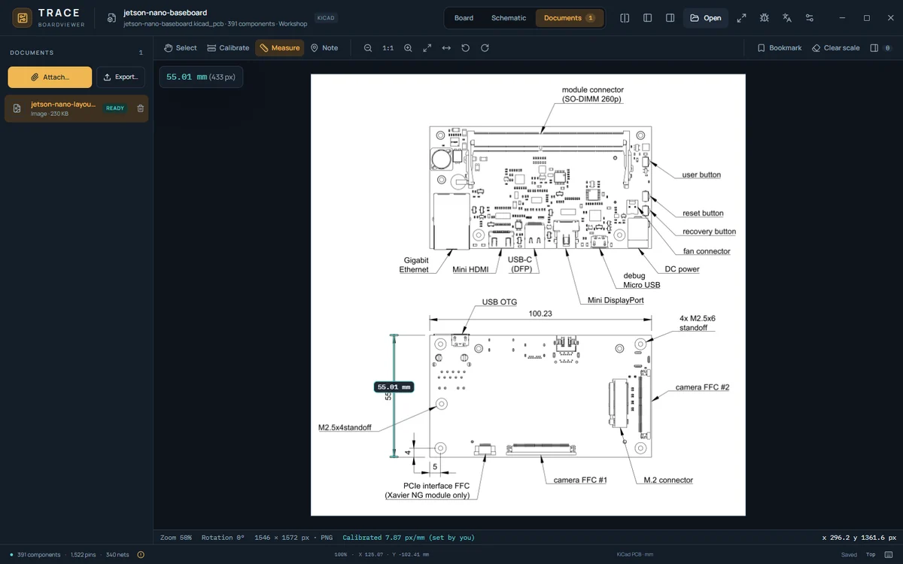
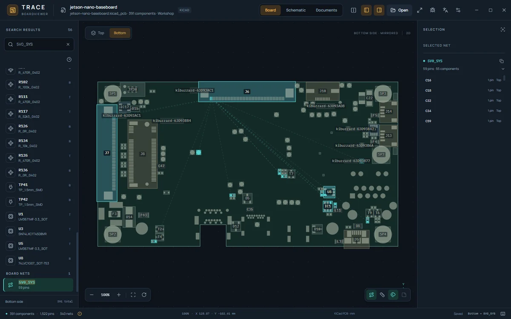

<p align="center">
  
</p>

<h1 align="center">TRACE Boardviewer</h1>

<p align="center"><strong>Free, open-source boardviewer for electronics repair.</strong><br>
Open a boardview or PCB file (KiCad, EAGLE, BVR, GenCAD and more) next to its schematic and PDF datasheets, offline and without an account.</p>

<p align="center"><a href="https://trace-boardviewer.github.io/"><strong>Website · 1-minute demo · guides</strong></a></p>

<p align="center">
  <a href="https://github.com/trace-boardviewer/trace-boardviewer/releases/tag/v1.3.1-rc.2"></a>
  <a href="https://github.com/trace-boardviewer/trace-boardviewer/releases/tag/v1.3.1-rc.2"></a>
  <a href="https://github.com/trace-boardviewer/trace-boardviewer/releases/tag/v1.3.1-rc.2"></a>
  <a href="https://donate.stripe.com/7sYaEZeET2op8PxaGE5EY00"></a>
</p>

<p align="center">Thank you for trying TRACE and sharing your feedback. Special thanks to everyone who uses the app and supports its development. Support is always optional.</p>

**Quick compatibility · 1.3.1-rc.2 (test version)**

| | What you can use | Scope or reason |
| --- | --- | --- |
| ✓ | GenCAD, KiCad PCB, EAGLE XML, Altium PcbDoc, EasyEDA Pro | Selected real exports checked; version and geometry limits apply. |
| ✓ | BRD/BRD2, BDV, BVR, ASC, BV/BV2, TVW, FZ/CAE, F2B | Selected boardview variants; some bodies and pad sizes are estimates. FZ/CAE tries default format keys. |
| ✓ | Native Allegro BRD | Real checks cover 16.2, 16.4, 16.5, 16.6 and 17.2; other documented layouts use synthetic tests. Unknown layouts are refused. |
| ✓ | Mentor Neutral, Tebo ICT pairs, Fabmaster FARC/FAZ | Documented component/pin subsets; companion files and omitted geometry are explained. |
| ✓ | KiCad/EAGLE/Altium schematics, PDFs and images | Offline search and cross-probe; scanned PDFs have optional English OCR. |
| ⚠ | HyperLynx, Fabmaster FATF, EasyEDA Standard, CSV/TSV, ZIP, XZZ | Draft validation; encrypted XZZ needs your session key. IPC-2581, IPC-D-356 and ODB++ were checked with open-tool exports; vendor writers remain unverified. |
| ✗ | Native PADS SDB, BRD_V1.0, VS2 listings, Gerber as a complete board | Recognized with an explanation; the complete electrical model or format mapping is missing or unverified. Request a readable export. |
| ✗ | Every dialect, unavailable encryption keys, PCB editing or copper routing | This is a viewer for documented layouts. Key entry is skippable; unsupported files never lock the app. |

Windows x64, macOS Apple silicon and Linux x86-64 share these features; macOS/Linux packages are experimental. [Full file types and exact limits](docs/SUPPORT.md).

<p align="center">Free and open source (MIT) · no account, no telemetry · 
<a href="https://ko-fi.com/tracerboardview">Ko-fi</a> · 
<a href="https://github.com/trace-boardviewer/trace-boardviewer/issues/new?template=bug_report.yml">Report a bug</a> · 
<a href="docs/SUPPORT.md">Supported formats</a></p>

<p align="center"><strong>Test version 1.3.1-rc.2.</strong> The downloads above point to the prerelease. The app's update check still offers stable releases only. See the <a href="CHANGELOG.md">full changes</a> and <a href="https://github.com/trace-boardviewer/trace-boardviewer/releases/tag/v1.3.0">previous stable release</a>.</p>

<p align="center">Open a board next to its schematic and datasheets, find a net or a part across all of them, keep your repair notes with the board, and work without an account or a connection.</p>

<p align="center"><strong>Jump to:</strong>
<a href="#run-the-portable-app">Run the app</a> ·
<a href="#run-on-linux-experimental">Linux</a> ·
<a href="#features">Features</a> ·
<a href="docs/SUPPORT.md">Supported formats</a> ·
<a href="#languages">Languages</a> ·
<a href="#supported-data-and-limitations">Limitations</a> ·
<a href="#develop-and-build">Build from source</a> ·
<a href="#share-and-contribute">Contribute</a> ·
<a href="CHANGELOG.md">Changelog</a> ·
<a href="SECURITY.md">Security</a></p>

<p align="center"></p>

An offline boardviewer and repair workspace for Windows, with experimental builds for macOS and Linux. Open a board (GenCAD plus several boardview, EDA and encrypted formats — see the [exact support table](docs/SUPPORT.md)), attach its schematics, PDF datasheets and reference images, search across all of them, cross-probe between board, schematic and documents, and keep local repair notes that survive a restart. The interface is available in eight languages; see [Languages](#languages). The support notice shown at start opens the Stripe or Ko-fi page in your browser only when you click one of its buttons, and Not now skips it.

At start TRACE can ask GitHub once whether a newer stable release exists and show a dismissible link; it never downloads or installs an update. Settings can turn this check off. Optional payment verification contacts the receipt service only when you choose Verify payment, sending the app's random support reference. Settings > Network lists permitted features and hosts and a clearable request log with time, feature, host and result. Board files, notes, payment details and credentials are never uploaded by the app.

## New since 1.3.0

- **More board formats:** native Allegro BRD, Jet BV, BV2, Unisoft F2B, Mentor Neutral, Tebo ICT pairs and Fabmaster FARC/FAZ; ODB++ models, IPC-2581, IPC-D-356, EasyEDA Standard/Pro, HyperLynx, Fabmaster FATF and CSV/TSV pin lists. Validation and geometry limits differ by reader; the [generated table](docs/SUPPORT.md) gives the exact scope.
- **Schematics and scanned documents:** Altium SchDoc joins KiCad and EAGLE schematics. Bundled English OCR makes scanned PDF pages searchable offline, with confidence marks, progress and Cancel.
- **Faster, cancellable work:** background search, a shared board index, GenCAD/KiCad import progress, a parser watchdog and memory-only ZIP board/companion opening. Fixed extensionless companion files have an all-files chooser option.
- **Reliable notes and viewing:** stable component/pin identities, backups during migration, visible unresolved notes, consistent part classification, schematic counterpart selection and corrected sheet fitting.
- **Optional support and networking:** hourly reminders and the heart remain skippable; provider-confirmed support hides both for a calendar year, including offline use. FZ/CAE tries published default format keys; other key entry has Skip and never activates or unlocks the application.
- **Safer imports and clearer failures:** expanded classic boardview variants, bounded malformed-input handling, strict counts/checksums, local content-free format diagnostics and specific explanations for unsupported PADS, BRD_V1.0, VS2 and layer variants.

The [complete changelog](CHANGELOG.md) includes every improvement and fix since 1.3.0, with Windows, macOS and Linux limits and the developer foundations that have no dedicated interface yet.

**Found a bug?** Thank you for testing and for telling us. Use the Report a bug button in the top bar of the app (or in the support notice at start), or open the [bug report form](https://github.com/trace-boardviewer/trace-boardviewer/issues/new?template=bug_report.yml) directly. Please do not attach proprietary or customer boardview files.

## Run the portable app

Download `TRACE-Boardviewer-<version>.exe` from a published GitHub release, or build it with the instructions below. The EXE contains the complete application and its Electron runtime. Copying that one file is enough: no installer, Node.js, source folder or `win-unpacked` directory is required to run it.

Open a board file with **Open** (or the localized equivalent) or drag it into the window; the [support table](docs/SUPPORT.md) lists the accepted formats. TRACE restores the last available board at the next launch.

The portable launcher extracts its runtime (about 500 MB) into a private temporary folder of its own for every launch (`%TEMP%\nsXXXX.tmp\app`; while the instance runs that folder holds about 1.1 GB in total, because the launcher keeps the packed archive and a second extracted copy next to the runtime) and removes it on normal exit, so several running instances — and a second launch that hands a board to a running instance — never touch each other's runtime. If a launch is killed (for example with Task Manager) or crashes, its folder may stay behind in `%TEMP%`; delete it by hand once no TRACE process is running. A 0-byte `%TEMP%\trace-boardviewer-portable-init.lock` is shared by all launches (it serializes their start-up for a few milliseconds) and can stay; it is safe to delete when no TRACE launch is starting. Settings, recent files and notes are stored separately in `%APPDATA%\TRACE Boardviewer`. Notes are associated with the board file's content hash, so renaming the board keeps its notes. Board files are read without modification. No board data is uploaded; the app works offline.

Release builds target Windows x64, Linux x86-64 and macOS Apple silicon. The macOS build is an experimental download (`TRACE-Boardviewer-<version>-mac-arm64.zip`): it is unsigned (ad-hoc signed, not notarized), so macOS blocks a downloaded copy until you allow it once. Move `TRACE Boardviewer.app` to Applications, run `xattr -dr com.apple.quarantine "/Applications/TRACE Boardviewer.app"` in Terminal and open the app normally; this removes only the download quarantine flag of that copy (on macOS 15 and newer, System Settings > Privacy & Security > Open Anyway also works when it is offered). It was validated on an Apple M3; Intel Macs and a universal build are not packaged or tested (see [docs/MAC_VALIDATION.md](docs/MAC_VALIDATION.md)).

## Run on Linux (experimental)

Each release from 1.3.0 on carries two packages of the same x86-64 build. They are built and smoke-tested automatically on Ubuntu 24.04 (GitHub Actions, virtual X display); they have not been tested on a desktop Linux machine yet, and other distributions, desktop environments and Wayland sessions are not tested either. Neither package is signed: check it against the `.sha256` file next to it (`sha256sum -c <file>.sha256`).

- **Ubuntu 24.04 or newer, Debian 12 or newer: `TRACE-Boardviewer-<version>-linux-amd64.deb` (recommended).** Install it with `sudo apt install ./TRACE-Boardviewer-<version>-linux-amd64.deb` and start TRACE Boardviewer from the application menu (or run `trace-boardviewer`). The package installs to `/opt/TRACE Boardviewer`. On systems with AppArmor 4, such as Ubuntu 24.04, it also installs the profile `/etc/apparmor.d/trace-boardviewer`, which lets Chromium's sandbox use user namespaces under Ubuntu's restriction. Remove it with `sudo apt remove trace-boardviewer`; your settings and notes stay.
- **Other distributions: `TRACE-Boardviewer-<version>-linux-x86_64.AppImage` (portable, nothing is installed).** Make it executable (`chmod +x`) and run it. Its static AppImage runtime needs no libfuse2. Where unprivileged user namespaces are allowed (Fedora, Debian, Arch and openSUSE by default) Chromium's sandbox works as usual. Ubuntu 23.10 and newer restrict them, so there the AppImage can only run without the sandbox; TRACE then asks before it starts that way (Quit is the default, and "Do not ask again" remembers a yes). Use the `.deb` on Ubuntu.

Settings, recent files and notes are stored in `~/.config/trace-boardviewer` (`$XDG_CONFIG_HOME/trace-boardviewer`); on Windows they are in `%APPDATA%\TRACE Boardviewer`. To keep them next to the AppImage instead, create a folder named like the AppImage file plus `.config` beside it (AppImage portable mode); rename the AppImage to a fixed name first if you want to keep that folder across updates. The update check works as on Windows: it only links to the release page, and you download the new package yourself.

Known limits: the window icon on GNOME under Wayland comes from an installed desktop entry (the `.deb` installs one; for the AppImage use an AppImage integration tool), Electron's ASAR integrity check is not available on Linux, and only x86-64 is built. See [docs/LINUX.md](docs/LINUX.md) for the sandbox, what is tested, troubleshooting and building the packages yourself.

## Features

- Search by component reference, value, package and net name — across the board, structured schematics and the text of attached PDFs, with results grouped by source and page/sheet.
- **Technician workspace:** Board, Schematic and Documents tabs, a split view with an adjustable divider, and a compact status area. Attach PDFs, images and KiCad/EAGLE/Altium schematics to a board; they are remembered per board (by SHA-256, with a board-relative path) and restored after a restart. Moved files are found again, missing ones can be relinked, changed ones are never adopted silently.
- **Schematic cross-probe:** exact reference/pin matching between board and schematic with disagreements, unmatched and ambiguous parts listed explicitly (never guessed); hierarchical sheets, repeated sub-sheets and multi-unit parts keep their identity.
- **PDF viewer:** offline pdf.js rendering, text search, selectable text, bookmarks and page notes; board references found in the text link to board parts. **Recognize text** makes scanned pages searchable with bundled English OCR; recognized words show their confidence and only exact, sufficiently confident board names become links.
- **Images:** PNG/JPEG/WebP and sanitized SVG with zoom, rotation, bookmarks and notes; millimetre measurement only after an explicit two-point calibration.
- Notes per component or per pin with technician-entered voltage/resistance values; project export of only the documents you tick.
- Open a board directly from a ZIP with its companion files; an archive containing more than one board is refused with the candidate names.
- Board view (zoom, position, rotation, side) is remembered per board; the **Link and aliases** panel lists reference/net differences between board and schematic and lets you confirm aliases explicitly.
- Component and pin inspection with a connected-component list and net highlighting.
- Top and mirrored bottom views, rotation, cursor-centred zoom, pan, board fit and selection fit.
- Two-point distance measurement in millimetres, with pin snapping.
- Per-component notes, recent boards and persistent appearance settings.
- Skippable support reminders at startup and once per hour during use; they wait for imports and other dialogs. A provider-confirmed Stripe or Ko-fi payment hides both the reminder and heart for one calendar year, including offline use. Verification sends only a random support code and is optional. Key entry can also be skipped.
- **Format diagnostic report:** analyze an unreadable board locally from Help, review counts and format facts, and save or copy the report yourself. No file content or key is included, and nothing is uploaded.
- Workshop and Focus layouts and dark/light/system themes.
- Interface in Hungarian, English, German, French, Italian, Slovak, Polish and Ukrainian, with instant switching (the technician-workspace features added in 1.2.0 are still English in every language; see [Languages](#languages)).
- Rendering optimizations for dense nets and large boards.

| Action | Shortcut |
| --- | --- |
| Open board | Ctrl + O |
| Search | Ctrl + F |
| Fit board | F |
| Rotate | R |
| Measure | M |
| Toggle labels | L |
| Component note | N |
| Zoom in / out | + / − |
| Workshop / Focus layout | Ctrl + 1 / 2 |
| Clear highlight / measurement | Esc |
| Board / Schematic / Documents tab | Alt + 1 / 2 / 3 |
| Split view on / off | Ctrl + \ |
| Keyboard shortcuts (help) | ? or F1 |

On macOS, Cmd replaces Ctrl and Option replaces Alt.

## Screenshots

TRACE 1.2.0 with openly licensed designs. More screenshots, a one-minute demo and step-by-step guides are on the [website](https://trace-boardviewer.github.io/).

<table>
<tr>
<td width="50%"><br><sub>A 28 MB KiCad board with one net highlighted (Antmicro Jetson Nano baseboard, Apache-2.0).</sub></td>
<td width="50%"><br><sub>EAGLE board and schematic cross-probed in the split view (SparkFun RedBoard, CC BY-SA 4.0).</sub></td>
</tr>
<tr>
<td width="50%"><br><sub>A board part found in the plotted schematic PDF, light theme (Pico 2 C from project-piCo, WTFPL).</sub></td>
<td width="50%"><br><sub>A hierarchical KiCad schematic: 8 sheets, sheet list and breadcrumb (Jetson Nano baseboard).</sub></td>
</tr>
<tr>
<td width="50%"><br><sub>An image calibrated on a known dimension, then measured in millimetres; the calibration value was typed by hand (Jetson Nano baseboard drawing).</sub></td>
<td width="50%"><br><sub>The mirrored bottom side with a net highlighted (Jetson Nano baseboard).</sub></td>
</tr>
</table>

## Languages

| Language | Native name | Code |
| --- | --- | --- |
| Hungarian | Magyar | `hu` |
| English | English | `en` |
| German | Deutsch | `de` |
| French | Français | `fr` |
| Italian | Italiano | `it` |
| Slovak | Slovenčina | `sk` |
| Polish | Polski | `pl` |
| Ukrainian | Українська | `uk` |

- **Choosing the language.** A fresh profile follows the system language when it is one of the eight, otherwise English. A profile saved before language support existed keeps the Hungarian interface it was used with; its theme, layout, recent boards and notes are unchanged. Once you pick a language it is saved with the other settings and always wins.
- **Switching.** Choose **Settings → Language**, where each language is listed by its own name. The interface changes instantly; the open board, selection and notes are not reloaded.
- **What is translated.** The welcome screen, the board view and its tools, the component inspector (selection, pins and nets, connections), settings, board information, recent boards and the first part of the help dialog, the support and update notices, loading and error messages, the native file dialog and the importer's errors and warnings.
- **Not translated yet.** The technician-workspace features added in 1.2.0 are English in every language: the Board / Schematic / Documents tabs and the save status, the search field and its results, the Documents and Schematic views and the PDF, image and schematic viewers, the note, link-and-aliases, export and encryption-key dialogs, the schematic, documents, notes and bookmarks sections of the inspector, the last rows of the help dialog and the workspace messages.
- **What is never translated.** Board data: component references, values, packages, net names and file names. Your own notes stay exactly as you wrote them. Units stay `mm`, and keyboard shortcuts do not change. Numbers and dates follow the selected language's conventions.

Translations live in feature namespaces under `electron/locales/<language>/`. See [CONTRIBUTING.md](CONTRIBUTING.md) to add or improve one.

## Supported data and limitations

**[docs/SUPPORT.md](docs/SUPPORT.md) is the exact, generated support table**: every recognized format with its variants, units, side rules, geometry (real or estimated), key and companion requirements, and what is not supported. Short version:

- **GenCAD 1.4** (`.cad`, `.gcd`), **KiCad PCB**, **EAGLE board XML**, **Altium PcbDoc** and **EasyEDA Pro** are validated with selected real files. The KiCad, EAGLE and Altium schematic readers and the PDF/image viewers also have real-file checks. **IPC-2581** XML boards and **IPC-D-356** netlists were checked against KiCad-written exports; other writers remain unverified. Each reader has its own geometry and record limits in the table.
- **Landrex/TestLink BRD**, **Honhan BDV** and **Samsung CAD** now open real exports checked by the maintainer, with component, pin and test-point counts checked against their records. These checks cover selected exports of each format, not every dialect. BDV outline radii are represented as straight segments; component bodies and some pad sizes are estimated.
- **ASUS FZ / ASRock CAE** open automatically and offline using published default RC6 keys. Real exports of both formats were checked by the maintainer with these defaults; other vendor variants remain unverified. Unencrypted containers and decoded text also open without a key, and another key can be supplied for the session. Board outlines are absent and component bodies are generated; physical scale and pad radii have not been independently confirmed. Missing pad dimensions use disclosed fallback markers.
- **TVW** imports declared components, test points and pins through their explicit physical-pad IDs, preserving pin labels, coordinates, nets, sides and dimensions. The complete records and every pin link in the real exports checked by the maintainer were verified independently. Export variants that are not known yet are refused with a precise error rather than guessed. Compact, height-word and extra-Pascal metadata layouts are covered. Board outlines and copper traces are absent; custom pad shapes use bounding boxes.
- **BVRAW_FORMAT_3** boardviews have selected real-export checks and cross-checks against open tool-written files from the kicad-boardview plugin. These establish the checked variants, not every export dialect.
- **TOPTEST BRD2**, **BVRAW_FORMAT_1**, the **ASC companion trio**, **Jet4 BV**, **BV2**, **Tebo ICT**, **Mentor Neutral**, **Fabmaster FARC/FAZ**, **Unisoft F2B** and selected native **Allegro BRD** layouts now have real-export checks. Fixed extensionless companions can be selected with the translated all-files filter. Physical geometry estimates and supported record subsets are disclosed in the table.
- **Draft readers** include XZZ PCB, HyperLynx, Fabmaster FATF, EasyEDA Standard and recognized CSV/TSV pin lists. Their compatibility is checked on original synthetic fixtures; unfamiliar pin-list columns need parser-level mapping because there is no mapping interface yet.
- **ODB++** product models (`.tgz`, `.tar.gz`, `.zip`) are read: components, pins, nets and the board profile; they are validated with files the open-source kicad-cli wrote from open designs, not with files from the vendor's own software.
- Native PADS SDB, BRD_V1.0 encoded boards, VS2 assembly listings and Gerber are **recognized by their bytes and explained, not imported**. CAST CST imports only documented component-layer mappings; other plane variants remain unsupported. ZIP archives containing one readable board and its companions can be opened directly, subject to archive limits.

Guides on the website: [getting started](https://trace-boardviewer.github.io/getting-started/) · [Linux packages](https://trace-boardviewer.github.io/linux/) · [1-minute demo](https://trace-boardviewer.github.io/demo/) · [KiCad PCB viewer](https://trace-boardviewer.github.io/kicad-pcb-viewer/) · [free EAGLE viewer](https://trace-boardviewer.github.io/eagle-viewer/) · [GenCAD viewer](https://trace-boardviewer.github.io/gencad-viewer/) · [open a .brd file](https://trace-boardviewer.github.io/open-brd-file/) · [open a .bvr file](https://trace-boardviewer.github.io/open-bvr-file/) · [comparison with other boardviewers](https://trace-boardviewer.github.io/boardview-software-comparison/) · [release notes](https://trace-boardviewer.github.io/changelog/)
- Schematics: KiCad `.kicad_sch` (6.0–9.0), KiCad legacy `.sch` (with its `-cache.lib`/`.lib`), EAGLE `.sch` and Altium `.SchDoc` (with sibling sheets and `.PrjPcb` for hierarchy). Altium real-file checks cover flat designs; repeated sheets and project scope have synthetic checks only.
- A PDF is a document, not a boardview or a netlist. Pages without a text layer (scans) can be read with the built-in text recognition (OCR, English, fully offline): recognized words are marked with their confidence, and only exact board names read with high confidence become links.
- Files are limited to 64 MiB; larger or pathological inputs are rejected with a precise error rather than guessed.

No customer or manufacturer board file is included in this repository or in the application. A `.cad` (or any) extension alone never identifies a format: TRACE detects formats by their bytes.

The importer preserves physical dimensions for pads whose shape the format states exactly. Other pad shapes are approximated by their bounds and reported in the board information panel; if pad dimensions are missing the view uses display markers and says so.

Connection guides show logical net relationships. They do not show actual copper traces. Schematic connectivity comes from the schematic file (KiCad: computed from wires, junctions, labels and power symbols; EAGLE: the nets the file declares), never from a PDF or an image.

## Develop and build

Use Node.js 24 or newer and the pnpm version declared in `package.json`.

```powershell
pnpm install --frozen-lockfile
pnpm setup:electron
pnpm dev:desktop
```

For a production renderer and native app:

```powershell
pnpm build
pnpm start
```

For a standalone portable Windows x64 release:

```powershell
pnpm package
```

The result is `release/TRACE-Boardviewer-<version>.exe`. The generated `release/win-unpacked` directory is a build intermediate and is not needed alongside the portable EXE. To create only the unpacked app for development, run `pnpm package:dir`. Packaging needs the `pnpm` executable on `PATH` (electron-builder collects the dependency tree with it; `corepack enable` provides it), and the wrapper patch in `patches/` is applied by `pnpm install`, so package only from a checkout installed that way.

Development and QA can use a separate data profile:

```powershell
pnpm dev:desktop --user-data-dir="$PWD\test-results\manual-profile"
```

The desktop shell uses a sandboxed renderer, context isolation and a restricted preload API; the packaged binaries carry Electron fuses that disable `ELECTRON_RUN_AS_NODE` and `NODE_OPTIONS` and load the application only from `app.asar` (integrity-checked on Windows and macOS; Electron does not offer that check on Linux). Project layout:

- `src/`: React UI and the workspace shell (`src/app/`, `src/components/`), canvas and geometry, board adapters and the dispatcher (`src/lib/formats/`), schematic parsers, connectivity and cross-probe (`src/lib/schematic/`, `src/lib/crossprobe.ts`), the PDF layer (`src/lib/pdf/`), images, the workspace model and parser workers.
- `electron/`: desktop window, local file access, the queued atomic store, document/workspace validation, project export and the translation catalogs in `electron/locales/`.
- `docs/`: the [support table](docs/SUPPORT.md) (generated) and the macOS notes.
- `assets/`: original TRACE icons and third-party license notices.
- `tests/`: native-shell, store and workspace checks (plus an opt-in real-Electron smoke test: `TRACE_ELECTRON_SMOKE=1 xvfb-run -a node --test tests/electron-smoke.cjs`).
- `scripts/`: development helpers and optional UI/performance checks.

## Verify changes

The normal test suite uses synthetic data and needs no private board:

```powershell
pnpm test
pnpm test:desktop
pnpm build
```

The technician-workspace flow (open board → attach PDF/image/schematic → search → cross-probe → note → restart → relink) has a synthetic end-to-end check that drives the real built Electron app; it needs a production build and a display (on Linux: `xvfb-run -a`):

```bash
pnpm build
xvfb-run -a pnpm qa:e2e
```

`pnpm qa:workspace` runs the shell's browser checks against a mock workspace (start with `pnpm dev` in another terminal; see the script header for the Chromium note), and the viewers have their own `scripts/qa-pdf-viewer.cjs`, `qa-schematic-viewer.cjs` and `qa-image-viewer.cjs` harness checks.

For synthetic async and renderer interaction checks, install Playwright Chromium and run a Vite server in another terminal with `pnpm dev`. These checks need no external board:

```powershell
pnpm exec playwright install chromium
pnpm qa:races
pnpm qa:renderer
```

The localization checks use their own synthetic board and exercise all eight languages, Unicode notes, settings migration and language restoration. Browser mode uses the running Vite server; the native modes load the production build:

```powershell
pnpm qa:localization --browser
pnpm build
pnpm qa:localization --electron
pnpm package:dir
pnpm qa:localization --packaged
```

Packaged localization checks default to `release/win-unpacked/TRACE Boardviewer.exe`. To verify another build, set `TRACE_PACKAGED_EXE` to the absolute path of its unpacked application executable:

```powershell
$env:TRACE_PACKAGED_EXE = (Resolve-Path 'test-results\final-release\win-unpacked\TRACE Boardviewer.exe').Path
pnpm qa:localization --packaged
```

Real-board UI and performance checks are optional local tools. Supply your own board outside the repository with `TRACE_TEST_BOARD` or `--board=<absolute-path>`. The UI scenario expects `AC1`, `AC15`, `U1`, `VU13` and `AGND_AUD`; adapt the script if your board differs.

```powershell
$env:TRACE_TEST_BOARD = 'path/to/reference-board.cad'
pnpm qa:browser
pnpm qa:electron
pnpm package:dir
pnpm qa:packaged
```

The performance workload expects `AC1` on the bottom side with a `GND` pin, and `GND` pads on both sides. Keep the same board and browser for a before/after comparison:

```powershell
pnpm qa:performance --label=before
# Apply the renderer change, then run the same workload again.
pnpm qa:performance --label=after
```

`before` is the default label and writes `test-results/performance-before.json`. The `after` run reads that baseline, checks that board/net counts are preserved and checks zoom timing for regressions. For a separate diagnostic run, `pnpm qa:performance --label=diagnostic --profile-zoom` also saves a Chromium CPU profile of the top-side GND zoom workload. Callback timings, frame gaps and forced canvas readback timings are reported separately.

`TRACE_QA_URL` sets the Vite URL for browser, race, renderer, localization browser and performance checks. They default to the local server on port 5173 (`localhost`, or `127.0.0.1` for renderer checks). `TRACE_BROWSER_CHANNEL=msedge` uses an installed Edge browser. `TRACE_EXPECT_COUNTS` can specify expected `components,pins,nets` counts for real-board UI and performance checks. Normal QA uses the project's declared Playwright dependency; the renderer harness additionally accepts `TRACE_PLAYWRIGHT_PATH` as an advanced fallback for environments that require an alternate installed Playwright module. QA output and isolated profiles stay under the ignored `test-results/` directory.

## Share and contribute

See [CONTRIBUTING.md](CONTRIBUTING.md) for code, translation and format contributions, and [RELEASING.md](RELEASING.md) for the release builds and the draft-release workflow. GitHub Actions tests and builds the application without any private board data. Release binaries belong in GitHub Releases rather than in Git history.

If TRACE saves you time, a GitHub star helps other technicians find it.

TRACE's original code and artwork use the [MIT license](LICENSE). Bundled dependencies and fonts retain their own licenses; see [THIRD_PARTY_NOTICES.md](THIRD_PARTY_NOTICES.md).
